# BlessedClothes - Ecommerce de Ropa Ficticio - Angular

Esta aplicación, construida utilizando Bootstrap y Angular, ofrece una gran experiencia para explorar y adquirir prendas de moda en un entorno virtual. Aprovechando las capacidades robustas de Angular, como servicios, componentes, enrutamiento y formularios reactivos, este proyecto proporciona una plataforma de compra en línea envolvente y amigable para los usuarios.

## Características Principales

### Carrito de Compras Funcional

Carrito de compras completamente funcional que te permite visualizar tus selecciones, conocer el precio por artículo y calcular el monto total de tu compra. Además, gracias al almacenamiento local, tus selecciones se conservarán incluso después de cerrar y reabrir la pestaña del navegador.

### Exploración de Prendas
Adéntrate en una amplia gama de prendas de moda, desde camisetas hasta chaquetas y pantalones. Cada prenda se presenta con detalles completos, incluyendo nombre, imagen y precio.

### Filtros Personalizados
Explora las prendas según tus preferencias utilizando filtros personalizados. Filtra por talla, género y tipo de prenda para encontrar exactamente lo que estás buscando.
Exploración Fácil
Nuestra interfaz de usuario intuitiva facilita la navegación por la tienda. Explora diferentes secciones, descubre las novedades, explora las prendas y accede al carrito de compras con un solo clic.

## Estructura del Código

## Servicios

•	filtrosService: 
Responsable de la lógica de filtrado de prendas basado en criterios como el tipo de prenda, el género y el tamaño (talle). Aplica filtros a una lista de prendas y devuelve la lista resultante.

•	Cart-service: 
Gestiona el carrito de compras en la aplicación Angular. Permite agregar y eliminar productos del carrito, calcular y mantener el precio total y los detalles de los productos en el carrito. También emite eventos cuando el carrito se actualiza para que otros componentes puedan reaccionar.

•	CalculadoraCuotasService: 
Calcula el precio de las cuotas para un producto en función del precio total y el número de cuotas seleccionadas.

•	PrendasService: 
Proporciona funcionalidades relacionadas con la gestión y obtención de datos de prendas dentro de la aplicación.

•	StoreService: 
Ofrece funciones para la obtención y filtrado de datos de tiendas y sucursales basado en criterios geográficos.
Componentes Destacados

## Componentes compartidos 

### Cart-List (Carrito de Compras) 
Muestra de forma organizada los productos en el carrito. Usa el servicio "CartService" para obtener la lista de productos en el carrito, calcular el precio total y gestionar las operaciones de agregar y eliminar productos. También utiliza el "CalculadoraCuotasService" para calcular el precio de las cuotas dinámicamente.

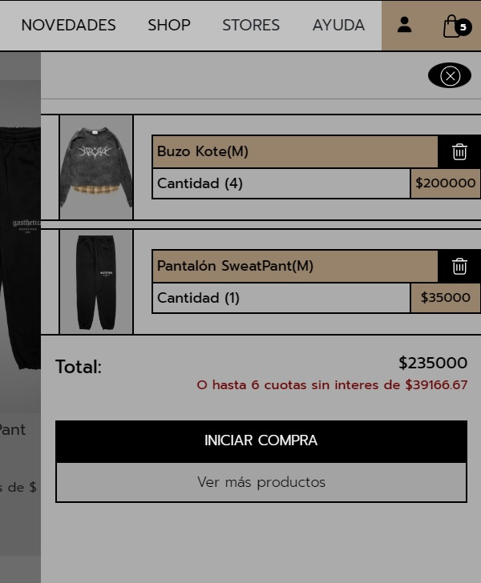

###	Slider 
Utiliza la librería ngx-slick-carousel para crear un carrusel interactivo que muestra prendas en una disposición deslizante configurado con [config] e inicializado con (init). Utiliza el componente personalizado "app-card" para representar cada prenda en el carrusel.

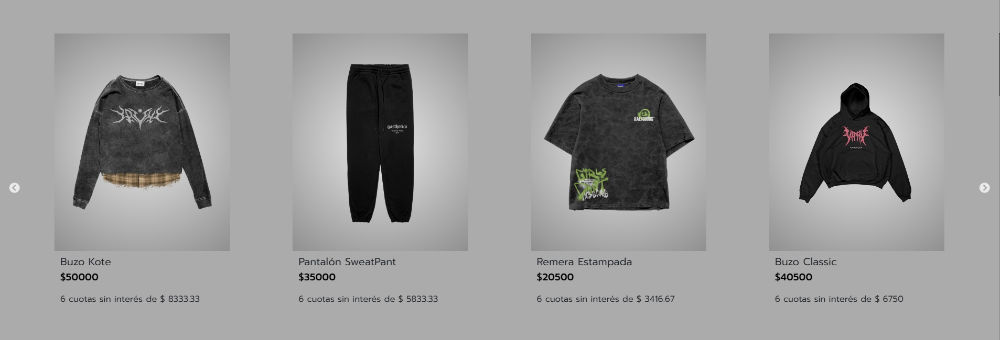

###	App-card 
Muestra detalles del producto como imagen, nombre, precio, cuotas disponibles y opción de seleccionar tallas. Permite agregar productos al carrito utilizando FormGroup para capturar cantidad y talla seleccionada, y para gestionar datos como nombre, ID, imagen, precio, etc. Utiliza RouterLink para redirigir a la página de detalles del producto.

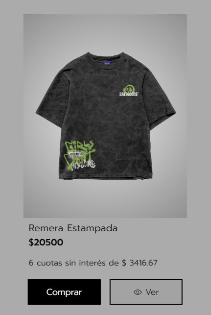
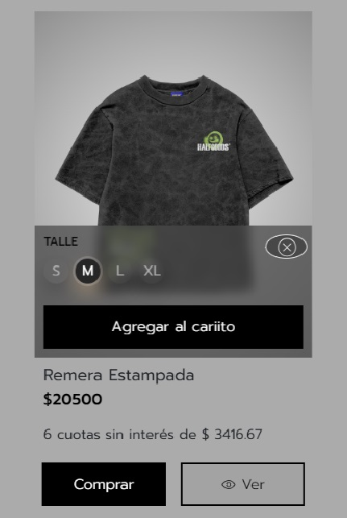

## Main component
Es el componente que se muestra al ingresar a la web, este componente contiene:

###	Hero Section 
Una primera impresión cautivadora para transmitir la identidad de la marca.

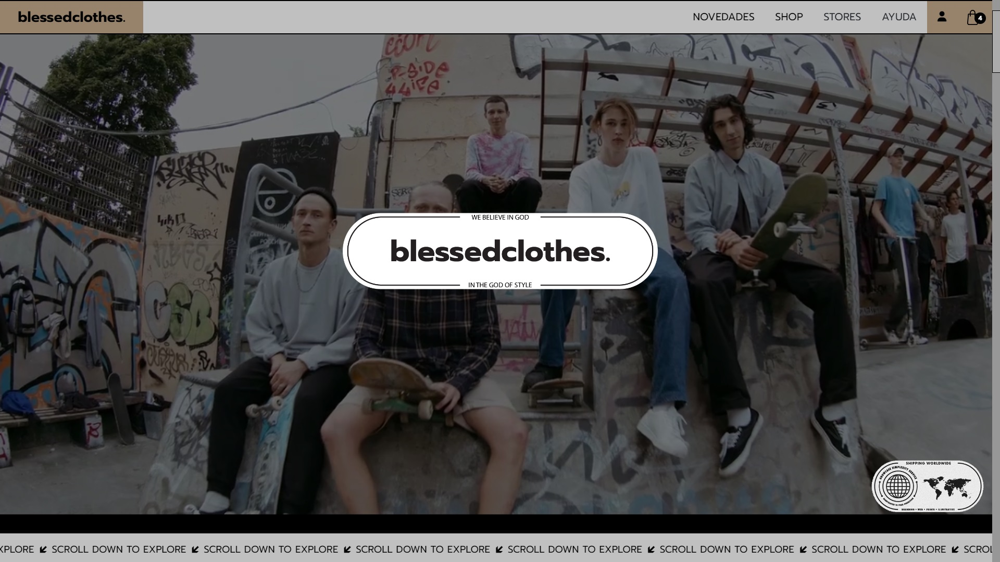

###	Novedades
Utiliza el componente Slider descripto anteriormente para mostrar prendas nuevas en un carrusel interactivo.

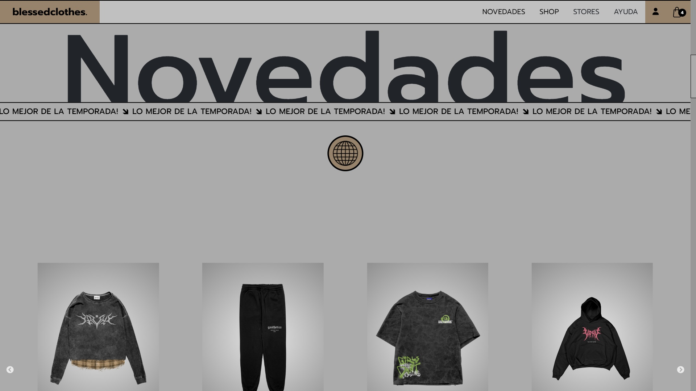

###	Prendas
Permite a los usuarios explorar diferentes tipos de prendas y acceder a la sección de compra mediante el Routing de Angular.

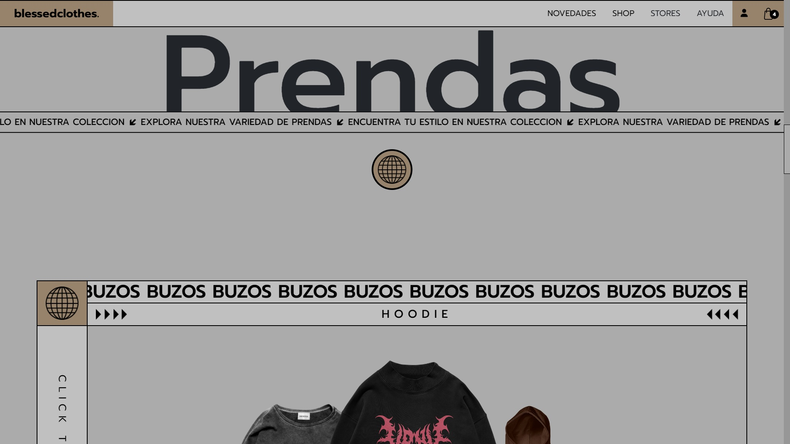

###	Newsletter
Permite a los usuarios subscribirse al newsletter para recibir ofertas de la marca.

###	Redes
Muestra de las redes sociales de la Marca.

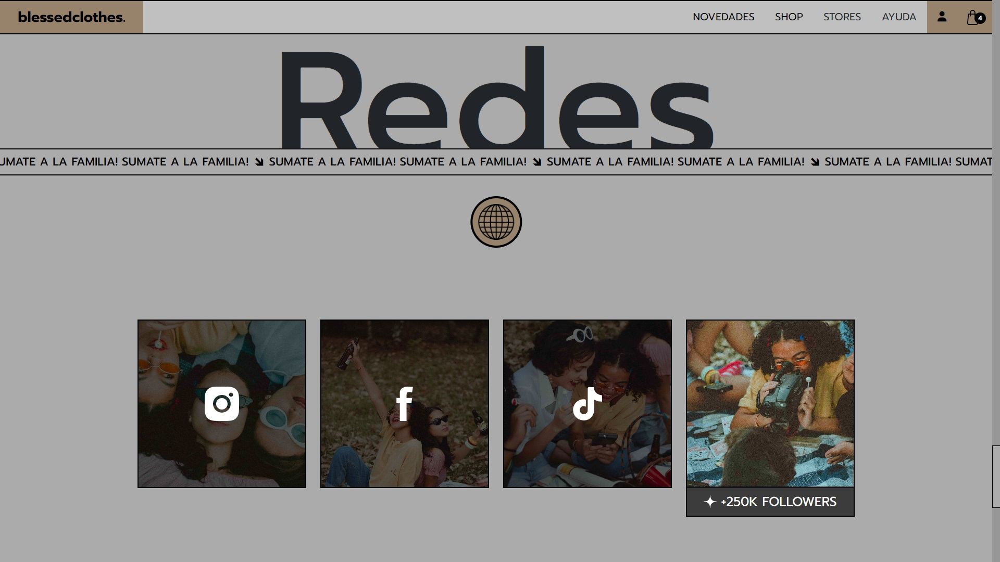

## Product-table 
Este componente se muestra al redirigirnos a la urlBase +‘/shop’ o al seleccionar Shop en el Nav.
El componente Muestra una lista filtrable de prendas disponibles, permitiendo explorar y filtrar opciones según preferencias individuales. Trabaja en conjunto con el servicio de filtros para brindar una experiencia de compra personalizada y eficiente.

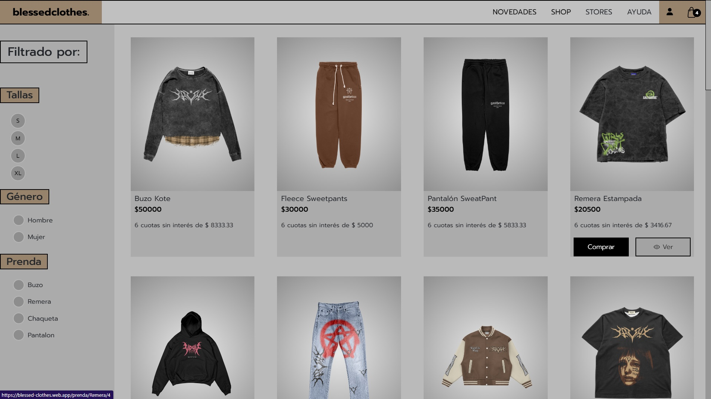

## Single Product
Este componente se activa al hacer clic en una de las tarjetas (card.component), las cuales nos redirigen a la URL 'prenda/:tipo:id'. 
Esta URL toma los parámetros 'tipo' e 'id' para poder mostrar el producto seleccionado de manera precisa. 
Utilizamos ActivatedRoute para obtener los parámetros de la URL, como el ID y el tipo de prenda, lo que nos permite cargar la información específica de la prenda deseada. Para gestionar las selecciones de tallas y cantidades, así como para agregar prendas al carrito, emplea un formulario reactivo .Las validaciones proporcionadas por "Validators" aseguran la integridad de los datos ingresados. Además, para enriquecer la presentación de las vistas y mejorar la experiencia del usuario, integra la librería externa "ngx-slick-carousel".

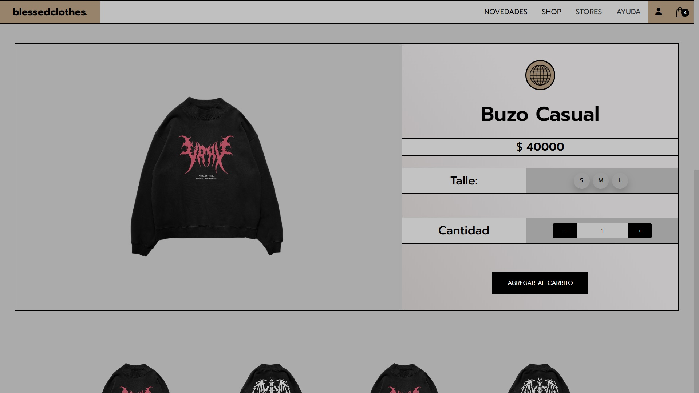
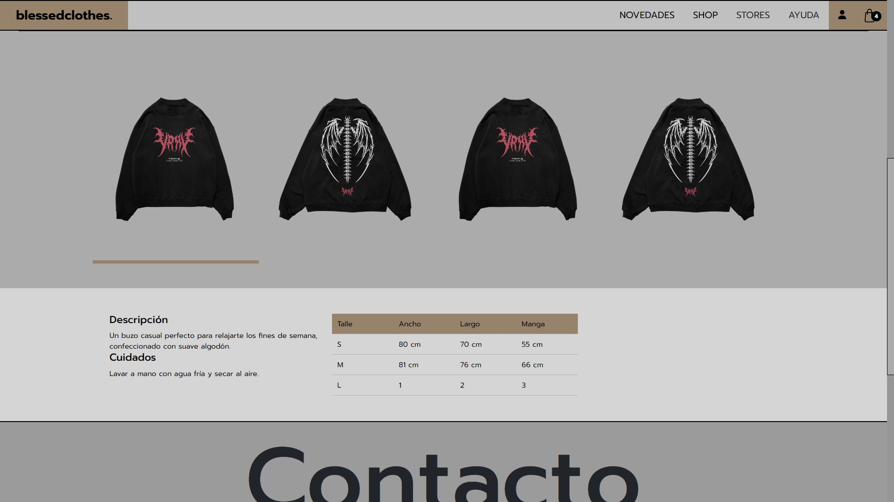

## 📩 Contacto

✦ Si estás interesado en comunicarte conmigo, te invito a que me contactes a través de [LinkedIn](https://www.linkedin.com/in/alan-castro-coelho-6bb6441a2/) o [Gmail](mailto:alancasstrocoelho@gmail.com)

✦ En el siguiente [Enlace](https://poked-x.web.app/) podras visitar la web en funcionamiento

